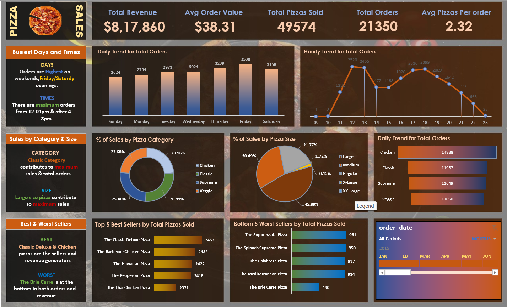

# 🍕 Pizza Sales Analysis

An end-to-end data analytics project that analyzes one year of pizza sales data. The data was cleaned in **Excel**, analyzed with **PostgreSQL** queries, and presented in an interactive **Excel dashboard**.

---

## 📖 Project Overview

The goal of this project is to analyze pizza sales data to understand business performance: how much revenue is generated, when customers order, which categories and sizes sell best, and which pizzas are best and worst performers.

## 🎯 Problem Statement

### KPI Requirements
| # | KPI | Definition |
|---|-----|-----------|
| 1 | **Total Revenue** | Sum of the total price of all pizza orders |
| 2 | **Average Order Value** | Total revenue ÷ total number of orders |
| 3 | **Total Pizzas Sold** | Sum of the quantities of all pizzas sold |
| 4 | **Total Orders** | Total number of orders placed |
| 5 | **Average Pizzas Per Order** | Total pizzas sold ÷ total number of orders |

### Chart Requirements
| # | Chart | Type |
|---|-------|------|
| 1 | Daily Trend for Total Orders | Bar chart |
| 2 | Hourly Trend for Total Orders | Line chart |
| 3 | % of Sales by Pizza Category | Pie / Donut chart |
| 4 | % of Sales by Pizza Size | Pie chart |
| 5 | Total Pizzas Sold by Pizza Category | Funnel chart |
| 6 | Top 5 Best Sellers by Total Pizzas Sold | Bar chart |
| 7 | Bottom 5 Worst Sellers by Total Pizzas Sold | Bar chart |

## 📂 Dataset

- **File:** `pizza_sales.csv`
- **Rows:** 48,620 order line items
- **Period:** 01 Jan 2015 – 31 Dec 2015

| Column | Description |
|--------|-------------|
| `pizza_id` | Unique ID of each order line item |
| `order_id` | ID of the order (one order can contain multiple pizzas) |
| `pizza_name_id` | Unique pizza identifier (name + size) |
| `quantity` | Number of pizzas in the line item |
| `order_date` | Date the order was placed |
| `order_time` | Time the order was placed |
| `unit_price` | Price of one pizza |
| `total_price` | `unit_price × quantity` |
| `pizza_size` | S, M, L, XL, XXL |
| `pizza_category` | Classic, Chicken, Supreme, Veggie |
| `pizza_ingredients` | Ingredients of the pizza |
| `pizza_name` | Name of the pizza |

## 🛠 Tools & Technologies

| Tool | Purpose |
|------|---------|
| **Microsoft Excel** | Data cleaning, pivot tables, dashboard |
| **PostgreSQL** | Querying and analysis (KPIs & chart data) |
| **SQL** | Aggregations, window of dates/time, subqueries |

## 🔄 Project Workflow

1. **Data cleaning** in Excel (formats, data types, duplicates/blank checks).
2. **Create table** in PostgreSQL and import `pizza_sales.csv`.
3. **Write SQL queries** for the 5 KPIs and 7 chart requirements.
4. **Build pivot tables and charts** in Excel.
5. **Design the dashboard** with KPI cards, charts, and a date timeline slicer.

## 🗄 SQL Analysis

### Create Table
```sql
CREATE TABLE pizza_sales (
    pizza_id          INT,
    order_id          INT,
    pizza_name_id     VARCHAR(50),
    quantity          INT,
    order_date        DATE,
    order_time        TIME,
    unit_price        NUMERIC(10,2),
    total_price       NUMERIC(10,2),
    pizza_size        VARCHAR(5),
    pizza_category    VARCHAR(50),
    pizza_ingredients TEXT,
    pizza_name        VARCHAR(100)
);
```

### KPI Queries
```sql
-- 1. Total Revenue
SELECT SUM(total_price) AS total_revenue
FROM pizza_sales;

-- 2. Average Order Value
SELECT SUM(total_price) / COUNT(DISTINCT order_id) AS average_order_value
FROM pizza_sales;

-- 3. Total Pizzas Sold
SELECT SUM(quantity) AS total_pizza_sold
FROM pizza_sales;

-- 4. Total Orders
SELECT COUNT(DISTINCT order_id) AS total_orders
FROM pizza_sales;

-- 5. Average Pizzas Per Order
SELECT ROUND(SUM(quantity)::NUMERIC / COUNT(DISTINCT order_id), 2) AS avg_pizzas_per_order
FROM pizza_sales;
```

### Chart Queries
```sql
-- Daily Trend for Total Orders
SELECT TO_CHAR(order_date, 'Day') AS order_day,
       COUNT(DISTINCT order_id)   AS total_orders
FROM pizza_sales
GROUP BY TO_CHAR(order_date, 'Day');

-- Hourly Trend for Total Orders
SELECT EXTRACT(HOUR FROM order_time) AS order_hour,
       COUNT(DISTINCT order_id)      AS total_orders
FROM pizza_sales
GROUP BY EXTRACT(HOUR FROM order_time)
ORDER BY order_hour;

-- % of Sales by Pizza Category
SELECT pizza_category,
       SUM(total_price) AS total_revenue,
       ROUND(SUM(total_price) * 100.0 / (SELECT SUM(total_price) FROM pizza_sales), 2) AS pct
FROM pizza_sales
GROUP BY pizza_category;

-- % of Sales by Pizza Size
SELECT pizza_size,
       SUM(total_price) AS total_revenue,
       ROUND(SUM(total_price) * 100.0 / (SELECT SUM(total_price) FROM pizza_sales), 2) AS pct
FROM pizza_sales
GROUP BY pizza_size
ORDER BY pct DESC;

-- Total Pizzas Sold by Pizza Category
SELECT pizza_category,
       SUM(quantity) AS total_quantity_sold
FROM pizza_sales
GROUP BY pizza_category
ORDER BY total_quantity_sold DESC;

-- Top 5 Best Sellers by Total Pizzas Sold
SELECT pizza_name, SUM(quantity) AS total_pizzas_sold
FROM pizza_sales
GROUP BY pizza_name
ORDER BY total_pizzas_sold DESC
LIMIT 5;

-- Bottom 5 Worst Sellers by Total Pizzas Sold
SELECT pizza_name, SUM(quantity) AS total_pizzas_sold
FROM pizza_sales
GROUP BY pizza_name
ORDER BY total_pizzas_sold ASC
LIMIT 5;
```
The full set of queries is in [`pizza.sql`](pizza.sql).

## 📊 Dashboard



The Excel dashboard contains:
- **KPI cards** – Total Revenue, Avg Order Value, Total Pizzas Sold, Total Orders, Avg Pizzas Per Order
- **Daily trend** (bar chart) and **hourly trend** (line chart)
- **% of sales by category** (donut) and **by size** (pie)
- **Pizzas sold by category** (funnel-style bars)
- **Top 5 / Bottom 5 pizzas** (bar charts)
- **Timeline slicer** on `order_date` to filter by month

## 🔑 Key Insights

### KPIs
| Metric | Value |
|--------|-------|
| Total Revenue | **$817,860** |
| Average Order Value | **$38.31** |
| Total Pizzas Sold | **49,574** |
| Total Orders | **21,350** |
| Avg Pizzas Per Order | **2.32** |

### Findings
- 📅 **Busiest days:** Friday (3,538 orders) is the peak, followed by Thursday and Saturday; Sunday is the slowest.
- ⏰ **Peak hours:** 12–1 PM (lunch rush) and 4–8 PM (evening), with the highest volume at 12 PM.
- 🍕 **Category:** Classic contributes the most to sales (~26.9%), with Chicken, Supreme, and Veggie close behind. By pizzas sold, Classic leads (14,888 units).
- 📏 **Size:** Large pizzas generate the highest share of revenue (~45.9%); XL and XXL contribute very little.
- 🏆 **Best sellers:** The Classic Deluxe, Barbecue Chicken, Hawaiian, Pepperoni, and Thai Chicken pizzas.
- 📉 **Worst seller:** The Brie Carre Pizza is at the bottom in both orders and revenue.

### Recommendations
- Staff up and prepare inventory for **Fridays** and the **lunch and evening peaks**.
- Promote **Large** pizzas and combo offers to increase average order value.
- Review or retire the **Brie Carre** pizza, or run a promotion to lift it.
- Use off-peak hours (mid-afternoon, late night) for discounts to smooth demand.

## 📁 Repository Structure

```
pizza-sales-analysis/
│
├── Pizza_Sales_Dashboard.xlsx   # Excel dashboard
└── README.md
├── dashboard.png          # Dashboard screenshot
├── pizza.sql              # PostgreSQL queries
├── pizza_sales.csv        # Raw dataset


```

## 👤 Author

**Mahesh Kumar**

